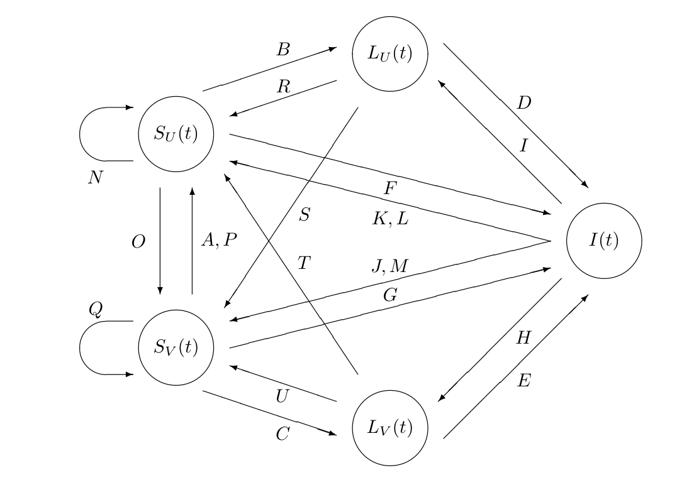
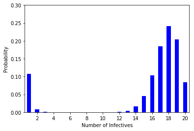
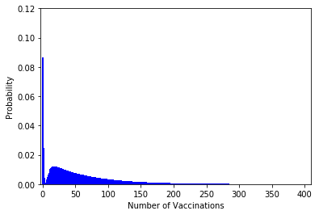
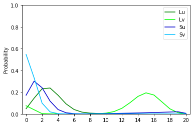

# Stochastic TB Vaccine Model

This repository contains the implementation of the stochastic epidemic model developed in:

> **R. Fernández-Peralta, A. Gómez-Corral** (2021).
> *A structured Markov chain model to investigate the effects of pre-exposure vaccines in tuberculosis control.*
> Journal of Theoretical Biology, 509, 110490.
> https://doi.org/10.1016/j.jtbi.2020.110490

---

## Overview

The model describes the transmission dynamics of tuberculosis (TB) in small, homogeneously well-mixed communities (e.g., child protection centers, long-stay hospital units, households), and evaluates the prospective impact of **pre-exposure (prophylactic) vaccines**.

The host population is divided into five compartments:

| Symbol | Description |
|--------|-------------|
| `I`    | Actively infected (infectious) individuals |
| `Lu`   | Unvaccinated latently infected individuals |
| `Lv`   | Vaccinated latently infected individuals |
| `Su`   | Unvaccinated susceptible individuals |
| `Sv`   | Vaccinated susceptible individuals |

The model incorporates:
- Endogenous reactivation and exogenous reinfection of latent TB
- Loss of vaccine protection over time (waning immunity)
- Host mortality from TB and from other causes
- Replacement of dying hosts by new susceptibles (vaccinated with probability η(q,C) = qC)



*Complete transition diagram of the LD-QBD process. Labels A–U correspond to the 21 transition types listed in Table 2 of the paper (infection, reactivation/reinfection, recovery, death/replacement, and vaccine waning).*

---

## Mathematical Framework

The epidemic process **X** = {X(t) : t ≥ 0} with X(t) = (I(t), Lu(t), Lv(t), Su(t), Sv(t)) is a **continuous-time Markov chain (CTMC)** on the state space S = {(i, lU, lV, sU, sV) : i + lU + lV + sU + sV = N}.

More precisely, the model is formulated as a **finite level-dependent quasi-birth–death (LD-QBD) process**, where level l(i) groups all states with exactly i infectious hosts. The infinitesimal generator Q has the block-tridiagonal structure:

```
     | 0     0   |
Q =  |           |
     | QTA  QTT  |
```

where states with I = 0 are **absorbing** (C(N+3,3) states) and states with I ≥ 1 are **transient** (C(N+4,4) − C(N+3,3) states).

The **random outbreak duration** τ is a **phase-type (PH) random variable** with representation (π_T, Q_TT).

### Probabilistic Descriptors Computed

All quantities are derived analytically via matrix-algebraic algorithms based on **block-Gaussian elimination** (Algorithms 1–5 in the paper):

| Quantity | Description | Module |
|----------|-------------|--------|
| F(I_max ≤ i) | CDF of max simultaneously infectious individuals | `DistrMaxNumInfectives.py` |
| P(V = v) | Distribution of total vaccinations during outbreak | `NumVaccinations.py` |
| R_exact,0 | Exact (random) basic reproduction number | `R0.py` |
| f(∞; S_A) | Hitting probabilities (final epidemic state) | `DistrMaxNumInfectives.py` |
| E[τ^k] | Moments of outbreak duration | `DistrMaxNumInfectives.py` |

### Stochastic Simulation

`Simulaciones.py` implements the **Gillespie algorithm** (Stochastic Simulation Algorithm, SSA) for validation against the analytical results. The algorithm:
1. Samples the time to the next event from an exponential distribution with rate equal to the sum of all transition rates
2. Selects which event occurs proportionally to individual transition rates
3. Updates the state accordingly

Two variants are implemented:
- `Sim_Trayectoria()` — full outbreak trajectory, returns (duration, max infectives, vaccinations)
- `Sim_Trayectoria_R0()` — tracks secondary infections from the initially infected host to estimate R₀

---

## Case Study (from the paper)

The numerical experiments consider N = 20 individuals aged 30–35, initially all susceptible except one actively infected host: **X(0) = (1, 0, 0, 19, 0)**. Three pre-exposure vaccines are compared across three coverage levels:

| Scenario | Take q | Coverage C | Vaccine description |
|----------|--------|-----------|---------------------|
| 1 | 0.4 | {0.2, 0.5, 0.8} | Low efficacy |
| 2 | 0.6 | {0.2, 0.5, 0.8} | Moderate efficacy |
| 3 | 0.8 | {0.2, 0.5, 0.8} | High efficacy |

Key results:
- R₀ ∈ (3.2, 3.5) — disease spreads in all scenarios, but vaccine significantly shortens the outbreak
- The distributions of I_max and V are **bimodal** — a feature absent in the deterministic ODE model
- A threshold η_max = qC ≈ 0.11457 determines whether increasing vaccine take reduces or increases expected vaccinations
- The stochastic model guarantees extinction; the equivalent ODE model converges to an endemic equilibrium

### Distribution of I_max (Scenario 2, q = 0.6, C = 0.5)



*Bimodal distribution: first peak corresponds to early extinction before the disease spreads; second peak reflects high TB colonization.*

### Distribution of Vaccinations (Scenario 2, q = 0.6, C = 0.5)



*Distribution of the cumulative number of vaccinations V during an outbreak.*

### Hitting Probabilities (Scenario 2, q = 0.6, C = 0.5)



*Marginal distributions of the final epidemic state: L_U (dark green), L_V (light green), S_U (dark blue), S_V (light blue).*

---

## Project Structure

```
stochastic-tb-vaccine-model/
│
├── Parameters.py                        # Model parameters (edit to configure)
├── StateGeneration.py                   # State space enumeration
├── BlockDiagonalSparseMatrices.py       # Sparse block-matrix utilities
│
├── InfinitesimalGenerator.py            # Q matrix (Algorithms 1 block structure)
├── InfinitesimalGeneratorR0.py          # Modified Q for R₀ (Algorithms 4–5)
├── InfinitesimalGeneratorVaccinations.py # Modified Q for vaccinations (Algorithms 2–3)
│
├── DistrMaxNumInfectives.py             # Algorithm 1: I_max distribution + hitting probs
├── NumVaccinations.py                   # Algorithms 2–3: vaccination distribution
├── R0.py                                # Algorithms 4–5: R₀ distribution
├── Simulaciones.py                      # Gillespie SSA simulation
├── ModeloDeterminista.py                # Deterministic ODE model (comparison)
├── DescriptionGenerator.py              # Prints matrix descriptions for inspection
│
├── main.py                              # Full analysis with plots
├── summary.py                           # Results summary with publication-quality plots
├── summary2.py                          # Streamlined summary (key metrics only)
├── MaxQV.py                             # Optimization: find q maximizing E[V]
│
├── figures/
│   ├── model_diagram.png                # Complete LD-QBD transition diagram (Fig. 1 of paper)
│   ├── imax_distribution.png            # Distribution of max simultaneously infected
│   ├── vaccinations_distribution.png    # Distribution of cumulative vaccinations
│   └── hitting_probabilities.png        # Final epidemic state distributions
│
├── examples/
│   ├── parameters.txt                   # Simplified parameter example
│   └── ParametersExamples.txt           # Additional parameter configurations
│
└── legacy/                              # Archive of earlier implementations
```

---

## Requirements

Python 3.7+ with:

```
numpy
scipy
matplotlib
pandas
```

Install with:

```bash
pip install -r requirements.txt
```

---

## Usage

### 1. Configure parameters

Edit `Parameters.py` to set the population size and epidemiological rates. The default values match the case study in the paper (N = 20, q = 0.8, C = 0.8).

### 2. Run the analysis

```bash
python summary.py      # Full results + publication-quality plots
python summary2.py     # Key statistics only (faster)
python main.py         # Detailed analysis with intermediate output
```

### 3. Stochastic simulation (Gillespie SSA)

```python
import Simulaciones as SIM
import random

random.seed(42)
duration, xmax, vaccinations = SIM.Sim_Trayectoria()
r0 = SIM.Sim_Trayectoria_R0()
```

### Computational Notes

The state space grows as C(N+4, 4), making computation expensive for large N:

| N  | States (J_T) | Approx. runtime |
|:--:|:------------:|:---------------:|
| 20 | 8,855        | ~1–2 min        |
| 50 | ~270,000     | ~5 min          |
| 100| ~4,400,000   | ~12 min         |

Algorithms 1, 3, and 5 have complexity O(Σ J'(i)³); Algorithms 2 and 4 have complexity O(Σ J'(i)³ + (1 + V_q) Σ J'(i)²), where J'(i) = C(N−i+3, 3) is the number of states at level i.

---

## Parameter Reference

| Parameter | Description | Default |
|-----------|-------------|---------|
| `global_N` | Population size | 20 |
| `global_q` | Vaccine take (fraction protected) | 0.8 |
| `global_C` | Vaccine coverage | 0.8 |
| `global_gamma` (γ) | Vaccine waning rate (yr⁻¹) | 1/5 |
| `global_alpha_u` (α_U) | Contact rate, unvaccinated susceptibles (yr⁻¹) | 5.2 |
| `global_alpha_v` (α_V) | Contact rate, vaccinated susceptibles (yr⁻¹) | 5.2 |
| `global_p_u` (p_U) | Prob. unvaccinated susceptible → actively infected | 0.15 |
| `global_p_v` (p_V) | Prob. vaccinated susceptible → actively infected | 0.0 |
| `global_a_u` (a_U) | Endogenous reactivation rate, unvaccinated latent (yr⁻¹) | 1.5×10⁻⁴ |
| `global_b_u` (b_U) | Exogenous reinfection rate coefficient, unvaccinated latent | 0.35 × α_U |
| `global_a_v`, `global_b_v` | Reactivation/reinfection rates, vaccinated latent | 0.0 |
| `global_delta_TB` (δ_TB) | TB mortality rate (yr⁻¹) | 0.2 |
| `global_delta_R` (δ_R) | Treatment (recovery) rate (yr⁻¹) | 4/3 |
| `global_delta_D` (δ_D) | Background mortality rate (yr⁻¹) | 3/5 |
| `global_xi` (ξ) | Prob. recovery → latent class | 1.0 |
| `global_sigma_l_u` (θ_U) | Prob. latent recovery is unvaccinated | 0.5 |
| `global_sigma_s_u` (θ̃_U) | Prob. susceptible recovery is unvaccinated | 1.0 |

---

## Citation

If you use this code, please cite:

```bibtex
@article{fernandez2021structured,
  title   = {A structured Markov chain model to investigate the effects of
             pre-exposure vaccines in tuberculosis control},
  author  = {Fern{\'a}ndez-Peralta, R. and G{\'o}mez-Corral, A.},
  journal = {Journal of Theoretical Biology},
  volume  = {509},
  pages   = {110490},
  year    = {2021},
  doi     = {10.1016/j.jtbi.2020.110490}
}
```
